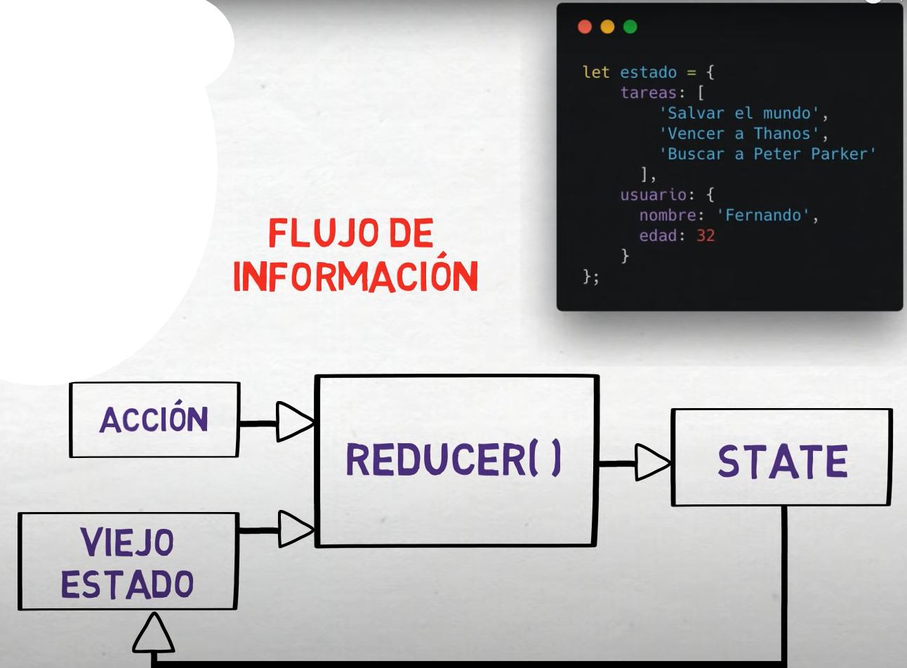

# Notas Redux -- NgRX

## Redux es un patron para el manejo de la información, que nos permite ver

 1. Cual es el estado de la app?
 2. Como cambio la información?
 3. Quien cambio alguna variable?
 4. Como se encuentra determinada variable?

## Ideas principales redux

- Toda la data de la app, se encuentra en una estructura previamente DEFINIDA.
- Toda la información se encontrará almacenada en unico lugar llamado: STORE.
- El store jamas se modifica de forma directa.
- Interacciones de usuario y/o codigo, dispara acciones que describen que sucedio.
- El valor actual de la informacion de la app se llama: estado - STATE.
- Un nuevo estado es creado, en base a la combinación del viejo estado y la una acción por
  una función llamada REDUCER.

## Estructuras importantes del patron redux

### ACTION - REDUCER - STATE - STORE

#### Action

Es la única fuente de información que se envía por interacciones de usuario o programa, por lo general, se busca que las acciones sean lo más simples posibles.

**Una acción tiene únicamente 2 propiedades:**

- type (obligatorio): Nos indica cual es la acción a realizar
- payload (opcional): Consiste en la informacion que requiera la tarea para realizar alguna accion

#### Reducer

Es una función que debe de recibir 2 argumentos, el reducer siempre va retornar un estado.
Los parametros que recibe son un **oldState(estado actual de la app)** y una **accion(lo que se va  buscar)**

#### State

El `State` es la representación actual del estado de la aplicación. Es una instantánea en un momento dado del tiempo que describe el estado de todas las entidades y componentes de la aplicación. El `State` es almacenado en el `Store` y es inmutable, lo que significa que no se puede cambiar directamente. En su lugar, se actualiza mediante la emisión de nuevas versiones del `State` a través de la propagación de acciones mediante el Reducer.

El STATE contiene variar reglas que se deben aplicar siempre, como estas:

1. El state es de sólo lectura.
2. Nunca se mutará el state de forma directa.
3. Hay funciones prohíbidas de JS, como son:
   1. Push.
   2. Manipulación directa del objeto oldState.

#### Store

Gestiona todo la app y es un objeto que tiene las siguientes responsabilidades:

- Contiene el estado de la aplicacion.
- Permite la lectura del estado via: `getState()`
- Permite crear un nuevo estado utilizando: `dispatch(ACTION)`
- Permite notificar cambios de estado via `subcribe()` para escuchar los cambios de un observable.

#### Diferencias entre STORE & STATE

El `State` es la representación inmutable y actual del estado de la aplicación. Contiene toda la información necesaria para describir el estado actual de la aplicación, como los datos de usuario, los datos de productos, las configuraciones de la aplicación, etc.

El `Store`, por otro lado, es una estructura de datos que almacena el `State` y proporciona una interfaz para acceder y modificar el mismo. El `Store` es responsable de mantener la única fuente de verdad o de datos única de la aplicación, es decir, el `State`.

**En otras palabras, el `State` es el contenido actual de la aplicación y el `Store` es el contenedor que lo mantiene y lo proporciona a la aplicación**.

El `State` es inmutable porque no se puede cambiar directamente, se actualiza mediante la emisión de nuevas versiones del `State` a través de la propagación de acciones mediante el Reducer. El `Store`, por otro lado, no es inmutable, sino que se actualiza cada vez que se emite una nueva versión del `State`.
